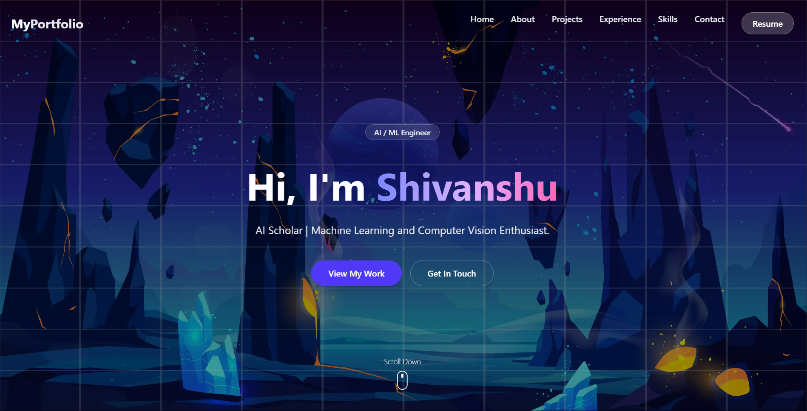

# 🚀 My.Portfolio — Digital Developer Portfolio


> A modern and responsive developer portfolio built with **React**, **Tailwind CSS**, and **Framer Motion**.  
> Showcasing projects, experience, skills, and ways to connect — all wrapped in a sleek UI.

[](LICENSE)
[](https://your-username.github.io/)
[](https://reactjs.org/)
[](https://tailwindcss.com/)

---

## 🌐 Live Demo

👉 **Hosted at:** [https://your-username.github.io](https://your-username.github.io)

---

## 📸 Preview

  
<sub>Desktop View | Responsive on all devices</sub>

---

## 📦 Tech Stack

- ⚛️ **React** — Component-driven development
- 🎨 **Tailwind CSS** — Utility-first styling
- 🎞️ **Framer Motion** — Animation and interactivity
- 🌐 **Vite** — Lightning-fast build tool
- ☁️ **GitHub Pages** — Deployment & hosting

---

## 📁 Project Structure

my-portfolio/ ├── public/ │ └── hero-bg.jpg ├── src/ │ ├── components/ │ │ ├── Navbar.jsx │ │ ├── Hero.jsx │ │ ├── About.jsx │ │ ├── Projects.jsx │ │ ├── Experience.jsx │ │ ├── Skills.jsx │ │ ├── Contact.jsx │ │ └── Footer.jsx │ ├── App.jsx │ ├── main.jsx │ └── index.css └── index.html


---

## 🛠️ Installation

```bash
# Clone the repository
git clone https://github.com/your-username/my-portfolio.git
cd my-portfolio

# Install dependencies
npm install

# Start local development server
npm run dev

```

## 🛠️ Installation

```bash
# Build the project
npm run build

# Optional: Add deployment script (vite + gh-pages)
npm install gh-pages --save-dev

# In package.json, add:
# "homepage": "https://your-username.github.io/",
# and under scripts:
# "predeploy": "npm run build",
# "deploy": "gh-pages -d dist"

# Deploy
npm run deploy

📬 Contact
📧 shivanshu8211@gmail.com
📍 Based in Hyderabad, India

Let's build the future together. Open to collaborations and opportunities.

📝 License
This project is licensed under the MIT License. See the LICENSE file for details.